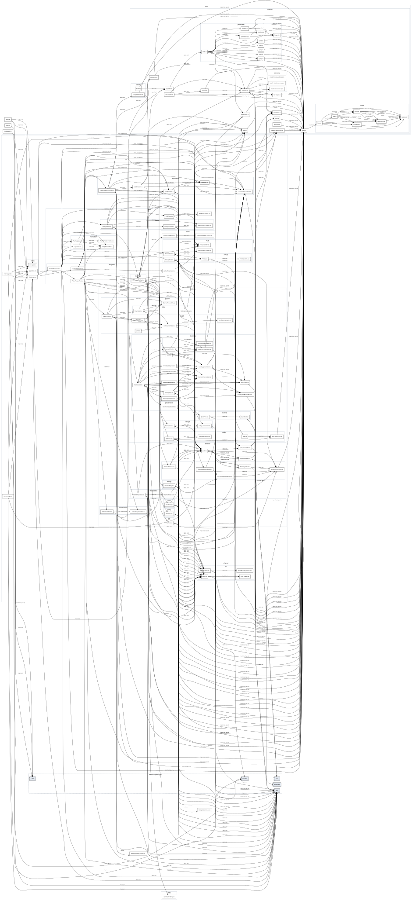

# Architecture Specification

This document details the system architecture, shared runtime boundaries, deployment adapters, data processing pipeline, and directory organization for the Crawler Command Interface.

## Architectural Overview

The Crawler Command Interface is a deterministic, replayable dungeon crawler HUD. The application operates as a point-in-time state projector: selecting a timeline sequence reconstructs the same historical HUD state without mutating that historical sequence.

```
+-------------------------------------------------------------------------+
|                         Shared Browser Application                       |
|                             (src/CrawlerApp.tsx)                         |
|                                                                         |
|  +------------------------+  +-------------------+  +----------------+  |
|  |  TimelineScrubber.tsx  |  | State Projection  |  | HUD Telemetry  |  |
|  |  (Sequence controls)   |  | (projection.ts)   |  | (Inspectors)   |  |
|  +------------------------+  +-------------------+  +----------------+  |
+-------------------------------------------------------------------------+
                    ^                                       ^
                    |                                       |
    +---------------+---------------+       +---------------+---------------+
    | ChatGPT Sites/Vinext Adapter |       | Static GitHub Pages Adapter   |
    | (app/page.tsx, Cloudflare)    |       | (src/main.pages.tsx, Vite)    |
    +-------------------------------+       +-------------------------------+
```

The overview above is a hand-authored conceptual view of runtime responsibilities and deployment boundaries. It is intentionally maintained separately from the file-level evidence.

### Generated Dependency Structure

The diagram below is generated structural evidence derived exclusively from Maritime's canonical `.maritime/dependency-graph.json`. The derived SVG presentation (`docs/images/dependency-graph.svg`) is rendered by Maritime using Graphviz, deriving module hierarchy recursively from repository source paths. It does not replace the conceptual diagrams in this document.



Do not edit the SVG by hand. After refreshing `.maritime/dependency-graph.json`, regenerate the diagram with `npm run generate:graph`.

## Execution Modes and Compatibility Boundaries

### Shared TypeScript Runtime

`src/CrawlerApp.tsx` and the shared domain modules are used by both deployment targets. The shared runtime must therefore remain compatible with the intersection of those environments.

Because the ChatGPT Live App is the more restrictive host, shared runtime code must remain safe to import and render through the Cloudflare Worker path. Host-specific behavior belongs in thin adapters rather than in divergent copies of the application.

Historical projection is immutable, not non-interactive: a user may initiate an action while viewing a historical sequence, but any resulting mutation is appended at the live timeline endpoint rather than rewriting history.

### ChatGPT Live App / Vinext Worker (`app/page.tsx`)

- Server-rendered React entry point for the ChatGPT Live App.
- Deliberately thin wrapper around `CrawlerApp.tsx`.
- Modules reachable during Worker import/render must not execute Ajv schema compilation, `eval`, `new Function`, Node-only APIs, or other Worker-incompatible behavior.
- Importing a module that depends on Ajv is acceptable when importing/rendering it does not execute dynamic schema compilation; validation may remain lazy or execute in browser/tooling contexts.

#### ChatGPT authentication and identity

`app/chatgpt-auth.ts` contains optional ChatGPT-host-specific identity helpers. This contract applies to the ChatGPT Live App adapter, not to the static GitHub Pages deployment.

- `oai-authenticated-user-email` supplies the authenticated user's email when host identity is available.
- `oai-authenticated-user-full-name` may supply an optional percent-encoded UTF-8 full name. Decode it only when `oai-authenticated-user-full-name-encoding` is `percent-encoded-utf-8`; otherwise treat the full name as unavailable and fall back to email.
- `getChatGPTUser()` reads optional identity supplied by the host.
- `requireChatGPTUser(returnTo)` redirects anonymous users through Sign in with ChatGPT.
- `chatGPTSignInPath(returnTo)` and `chatGPTSignOutPath(returnTo)` construct host-owned authentication paths and validate same-origin relative return paths.
- Protected server-rendered pages that depend on per-request identity headers must use dynamic rendering.
- `/signin-with-chatgpt`, `/signout-with-chatgpt`, and `/callback` are reserved host routes and must not be implemented by the application.
- SIWC establishes identity only; it does not prove workspace membership or authorization. Workspace access must come from hosting policy or explicit server-side authorization checks.

### Static GitHub Pages (`src/main.pages.tsx`, `index.html`)

- Standalone browser-only Vite entry point for static hosting.
- Mounts the same `CrawlerApp.tsx` directly in the browser DOM.
- Supports configurable base paths through `PAGES_BASE_PATH`, defaulting to `/crawler-command-interface/`.
- The current app has no history-based client routes. Before adding history-based routing, add an appropriate static Pages fallback (for example, a `404.html` strategy) so direct navigation does not fail.
- ChatGPT identity headers, reserved auth routes, and Worker-specific hosting behavior do not apply in this mode.

### Node Authoring, Build, and Verification

Authoring/build tooling runs in Node.js and may use Node-only capabilities that are intentionally excluded from the shared runtime, including:

- Ajv schema compilation and validation
- filesystem access
- raw floor loading (`app/domain/raw-loader.ts`)
- raw floor compilation (`app/domain/raw-compiler.ts`)
- generated fixture synchronization
- Node-based tests and build scripts

This tooling boundary is where source evidence is validated and transformed into runtime data.

## Data Processing Pipeline: Raw → Generated Floor → Compiled Timeline → Projection

```
  +-----------------------------------+
  | data/raw/catalogs/*.json          |  <-- Shared catalog definitions
  | data/raw/floors/floor-*/*.json    |  <-- Hand-authored evidence, events & observations
  +-----------------------------------+
              |
              v (app/domain/raw-loader.ts)
  +-----------------------------------+
  | RawCrawlerFloorDocument           |  <-- In-memory raw domain contract
  +-----------------------------------+
              |
              v (npm run generate:fixture / scripts/sync-derived-fixtures.mjs)
  +------------------------------+
  | data/floors/*.json           |  <-- Generated compatibility floor documents (transitional scaffolding)
  | data/compiled-timeline.json  |  <-- Generated global timeline artifact
  +------------------------------+
              |
              v
  +-------------------------------------------+
  | app/domain/fixtures/compiled-timeline.ts |  <-- Stable Worker-safe import wrapper
  +-------------------------------------------+
              |
              v
  +-------------------------------------------+
  | Replay Engine & Domain Projectors         |
  | - projectState (projection.ts)            |
  | - projectObservations (observations.ts)   |
  | - projectCountdownState (countdowns.ts)   |
  +-------------------------------------------+
              |
              v
  +-------------------------------------------+
  | Rendered HUD                              |
  +-------------------------------------------+
```

### Raw → Generated → Compiled Lifecycle

1. **Authored Raw Story Documents (`data/raw/`)**:
   - Authoritative source of truth for storyline events, observations, countdown anchors, evidence, and shared catalogs.
   - Authored manually in decomposed concern-specific files (`catalogs/` and `floors/floor-*/`) and loaded via `app/domain/raw-loader.ts` to form `RawCrawlerFloorDocument` contracts validated against `app/domain/schema/crawler-floor-raw.schema.json`.
2. **Generated Floor Compatibility Documents (`data/floors/*.json`)**:
   - Transitional compatibility scaffolding that mirrors floor-scoped authoring documents (`crawler-floor/v2`).
   - Kept in place to prevent breaking existing tooling, tests, or external importers while raw decomposed authoring (`data/raw/`) matures. Retained as transitional scaffolding rather than removed prematurely.
3. **Compiled Global Timeline (`data/compiled-timeline.json`)**:
   - Single, ordered runtime timeline artifact generated by compiling raw floor documents via `compileRawFloorFiles` in `app/domain/raw-compiler.ts`. Assigns globally increasing sequence numbers and merges catalogs and sources across floors.

### Generated Runtime Data and Worker-Safe Wrapper

`npm run generate:fixture` writes derived floor JSON to `data/floors/` and the compiled runtime timeline to `data/compiled-timeline.json`.

`app/domain/fixtures/compiled-timeline.ts` is a stable TypeScript wrapper that imports the generated JSON as `CrawlerTimelineDocument`. The wrapper is not generated by the fixture sync command and may be changed when the runtime import contract itself needs to change.

Keeping raw validation and compilation in Node tooling prevents Ajv code generation from executing during ChatGPT Worker import/render while still allowing the shared browser application to consume validated generated data.

## Validation & Extension Guidelines

### Schema vs. Semantic Validation Boundary

- **JSON Schema (`app/domain/schema/`)**: Owns syntactic and shape validation, including required properties, field types, enums/consts, discriminator logic, and string pattern/regex constraints across `crawler-floor-raw.schema.json`, `crawler-floor.schema.json`, and `crawler-timeline.schema.json`.
  - *Schema Duplication Strategy*: While event payload structures are similar across raw, generated, and compiled contracts, JSON schemas are intentionally kept separate and self-contained rather than dynamically shared via external `$ref` fragments. This ensures draft 2020-12 schemas remain directly bundleable and portable in Cloudflare Worker / browser validation contexts.
- **Semantic Domain Validation (`app/domain/validation.ts`)**: Owns runtime and cross-record invariants, such as checking that referenced catalog item/achievement/source IDs exist, verifying floor-scoped event ID prefixes and contiguous floor order, enforcing strictly increasing timeline sequence numbers, validating countdown phase break monotonicity, and checking item acquisition provenance. Redundant syntax/shape checks guaranteed by JSON Schema are omitted from semantic validation.

### Adding New Domain Events

- **Generic Compilation Default**: New event types use `compileIdentityEvent` in `app/domain/compiler.ts` by default. Creating specialized compiler handlers in `specializedCompilers` is required only when the compiled representation genuinely transforms the raw payload (e.g., catalog ID resolution or adding compiled fields).
- **Domain Projection**: State transitions belong in domain-focused projection modules under `app/domain/projection/` (`crawler.ts`, `inventory.ts`, `achievements.ts`, `magic.ts`, `party.ts`, `quests.ts`, `broadcast.ts`), registered in the orchestrator reducer registry in `app/domain/projection/index.ts`.
- **UI State Consumption**: Custom React UI components must consume projected state (`CrawlerState` or `ProjectedObservationsState`) produced by the deterministic replay engine rather than creating a secondary raw data authority.

## Deterministic State Projection

- **Event Projection (`app/domain/projection.ts`)**: Applies causal events (`ItemAcquired`, `AttributeModified`, `ConditionChanged`, etc.) to produce point-in-time crawler state.
- **Observation Telemetry (`app/domain/observations.ts`)**: Projects non-causal readings with evidence provenance. Non-discrete readings may interpolate between compatible anchors according to the authoring rules in [RAW_OBSERVATIONS.md](../RAW_OBSERVATIONS.md).
- **Countdown Engine (`app/domain/countdowns.ts`)**: Derives exact countdown values at references and compatible estimates between/after references while respecting lifecycle phase breaks.
- **Snapshots**: Replay normally derives state from the event stream. Snapshot support remains an allowed optimization, but generation/invalidation should only be introduced when measured replay cost justifies it.

## File Placement & Repository Directory Map

```
/
├── app/
│   ├── components/         # HUD React components (TimelineScrubber, inspectors)
│   ├── domain/             # Core projection, countdown, observation, types, schemas
│   │   ├── fixtures/       # Stable runtime import wrapper
│   │   ├── raw-loader.ts   # Raw floor loader and assembler
│   │   └── schema/         # JSON schemas used by authoring/tooling validation
│   ├── chatgpt-auth.ts     # ChatGPT-host-specific identity helpers
│   └── page.tsx            # ChatGPT Sites / Vinext Worker entry point
├── src/
│   ├── CrawlerApp.tsx      # Shared browser React application
│   └── main.pages.tsx      # GitHub Pages static client entry point
├── data/
│   ├── raw/                # Hand-authored decomposed story evidence
│   │   ├── catalogs/       # Shared item, achievement, crawler, skill, spell definitions
│   │   └── floors/floor-*/ # Floor metadata, catalog.json, events.json, observations.json, countdowns.json, sources.json
│   ├── floors/             # Generated compatibility floor JSON
│   └── compiled-timeline.json # Generated runtime timeline data
├── scripts/                # Node build, fixture-sync, and environment scripts
├── tests/                  # Node tests (unit/, rendered/, artifacts/, benchmark/, e2e/, screenshots/)
├── worker/                 # Worker runtime configuration/support
├── index.html              # Static Vite Pages entry point
├── vite.config.ts          # ChatGPT Sites / local development configuration
└── vite.pages.config.ts    # Static GitHub Pages build configuration
```

## Durable Architectural Invariants

1. **Authoritative raw evidence**: Story evidence is authored only in `data/raw/` (`catalogs/` and `floors/floor-*/`).
2. **Generated data boundary**: `data/floors/*.json` and `data/compiled-timeline.json` are generated by `npm run generate:fixture`; do not hand-edit them.
3. **Stable runtime wrapper**: `app/domain/fixtures/compiled-timeline.ts` is the Worker-safe import wrapper around generated JSON, not generated output itself.
4. **Immutable history**: Selecting an earlier sequence reconstructs historical state without mutation; interactions append new events at the live endpoint.
5. **Shared runtime portability**: Shared application/domain runtime must remain compatible with both deployment targets and safe to import/render through the ChatGPT Worker path.
6. **Tooling separation**: Node-only authoring/build behavior, including Ajv compilation and filesystem access, belongs outside the shared runtime.
