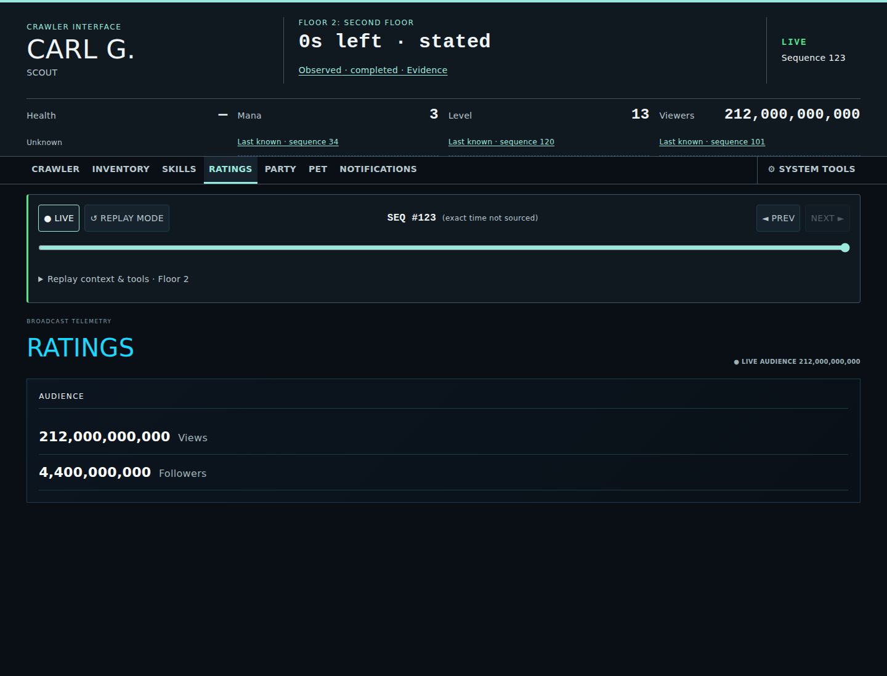
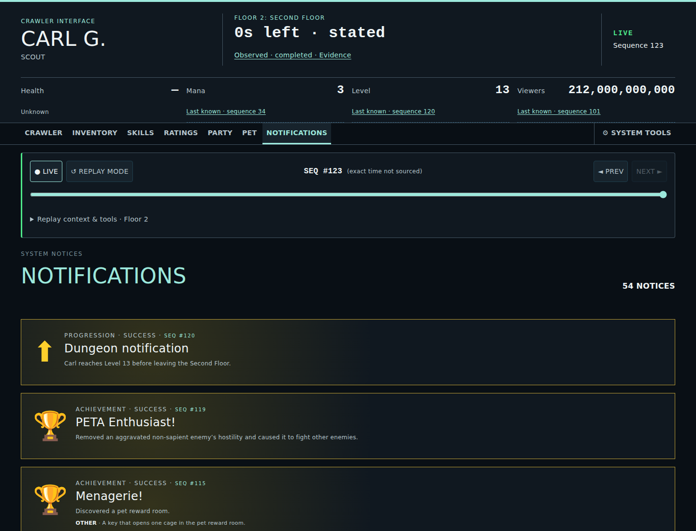
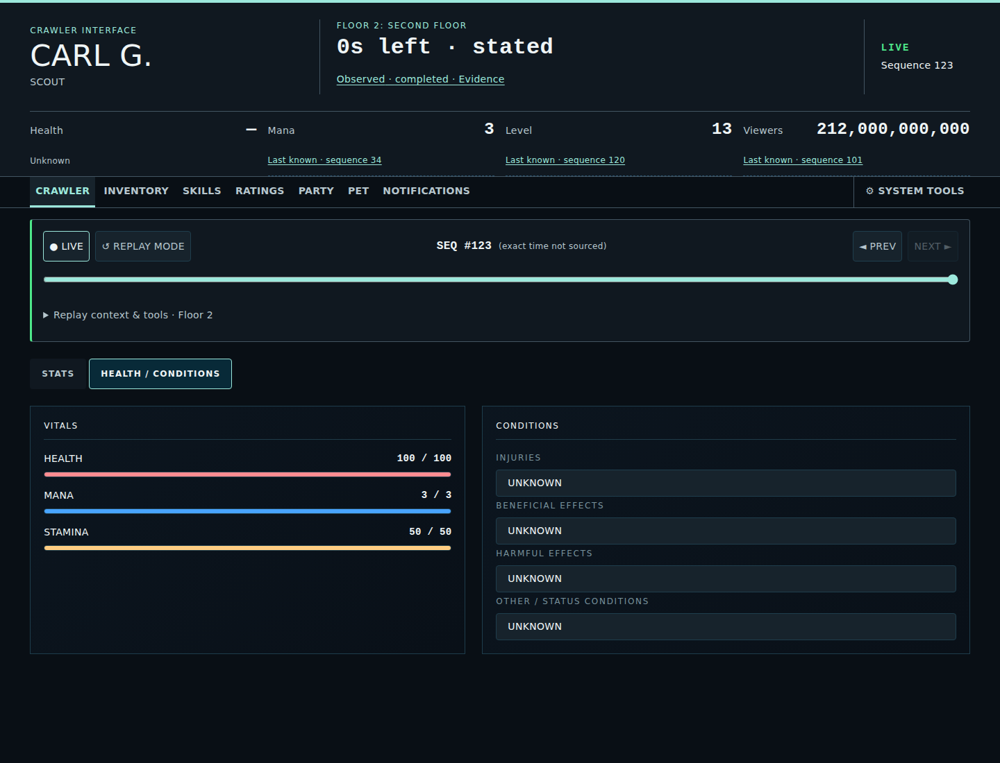

# Interface Screenshots

These images are generated canonical views of the Crawler Command Interface. Refresh the complete set with `npm run test:screenshots`; do not retouch generated images manually.

The persistent timeline in every view remains replay-aware. The compact viewer counter and the ten-slot, point-in-time Hotlist stay in the persistent HUD, while assignment controls remain in Skills.

Only domains unlocked by meaningful projected storyline state appear in navigation. Magic, Sponsorship, Party, Messages, Minimap, Pet, and other extensions remain conditional rather than universally available.

## Top-level views

### Crawler

### Inventory

### Skills

### Quests

### Ratings
Broadcast-domain observations are presented in canon-aligned Ratings groups without renaming the underlying data model.

### Notifications
Only source-backed crawler-visible semantics are represented; generic Timeline activity remains separate.

## Crawler views

### Player Stats

### Health / Conditions
Vitals are separate from beneficial, harmful, injury, and other condition presentation. Injuries are never inferred from effect text.

## Timeline and floor context views

### Floor Rules

### Timeline History

