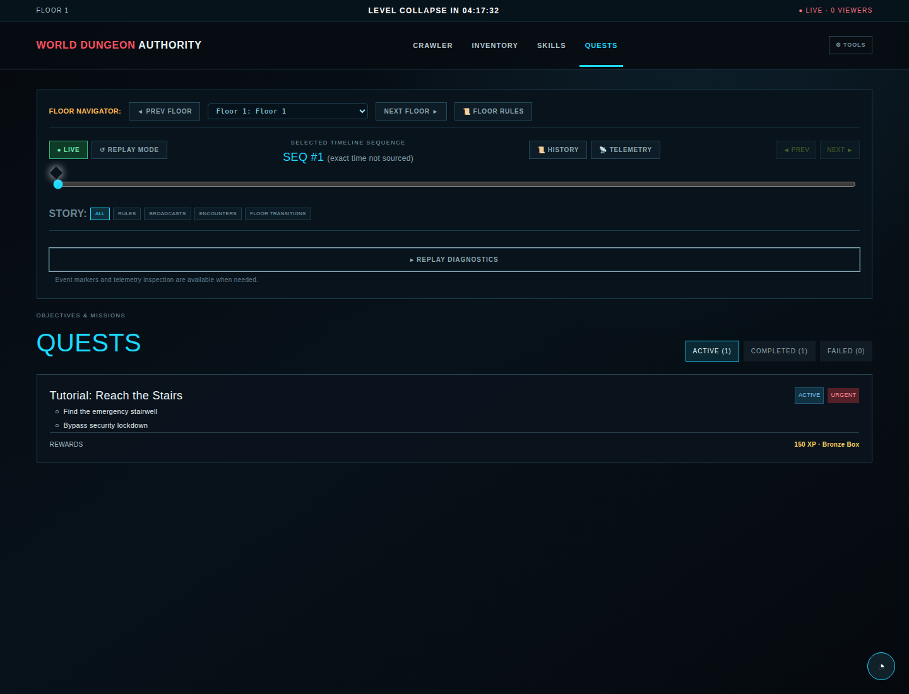
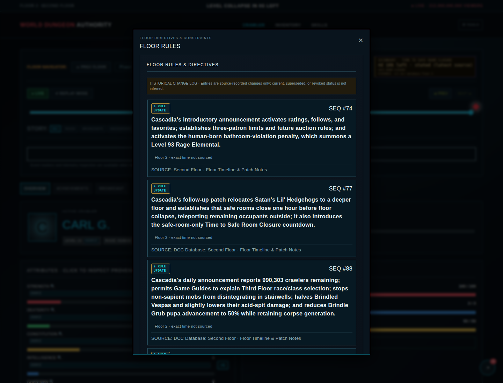
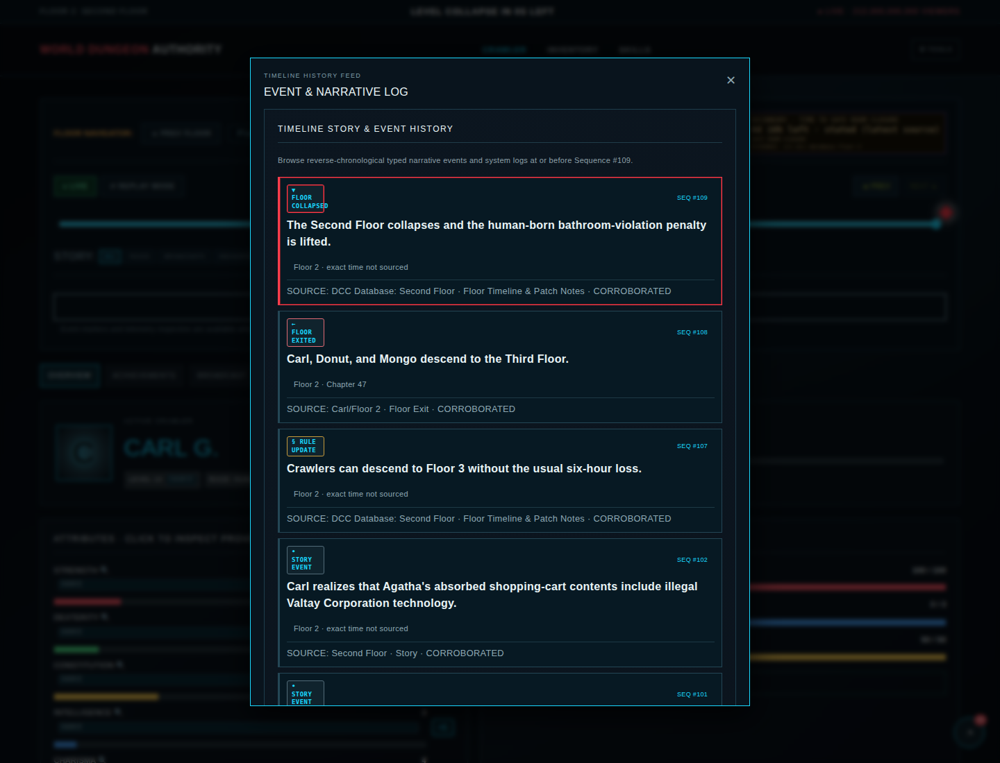

# Interface Screenshots

These images are generated canonical views of the Crawler Command Interface. They are refreshed by `npm run test:screenshots` and by the pull-request screenshot workflow when UI, fixture data, Pages rendering inputs, or screenshot-generation code changes.

Do not retouch these files manually. If a documented interface state changes, update the application or screenshot-generation code and regenerate the assets.

The persistent timeline shown in every canonical view keeps floor selection, sequence scrubbing, typed story markers, replay stepping, and return-to-Live controls visible. Primary collapse timing is presented once in the persistent HUD; sourced secondary timers and countdown evidence remain contextual timeline details.

## Top-level views

### Crawler

### Inventory

### Skills

### Quests

## Crawler profile views

### Overview

The overview intentionally omits the duplicate broadcast summary; audience details remain documented in the Broadcast view.

### Achievements

### Broadcast

## Timeline and floor context views

### Floor Rules

### Timeline History

