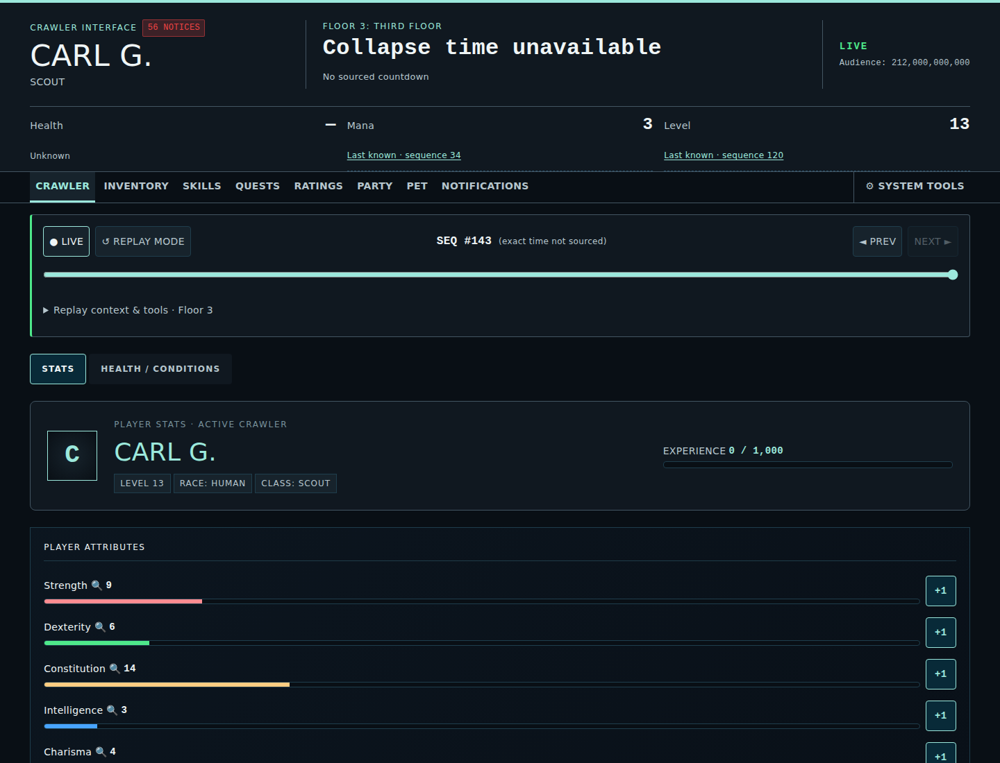
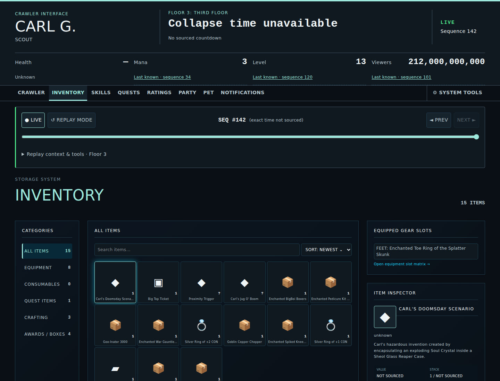
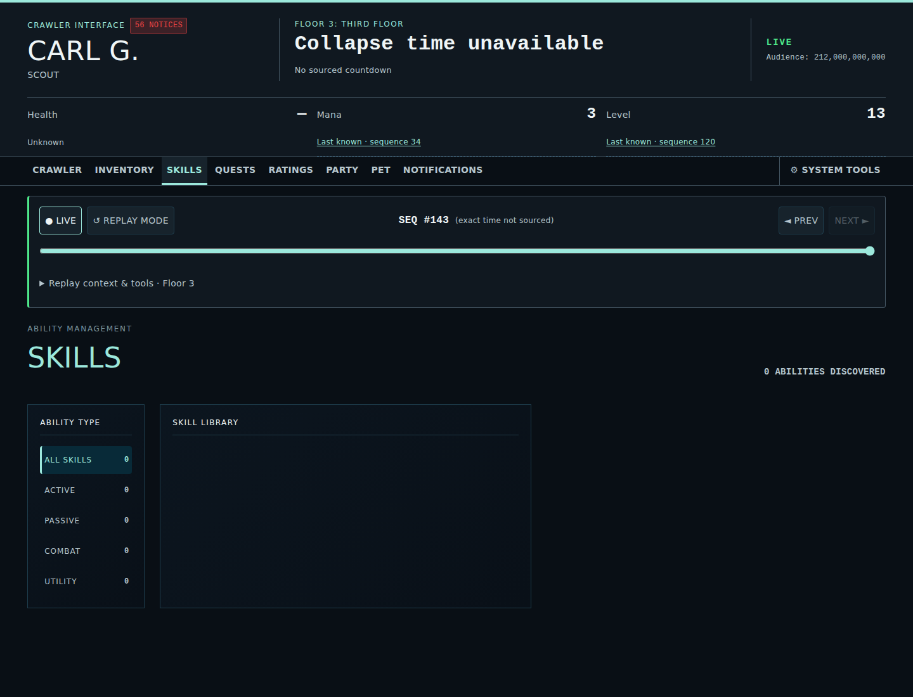
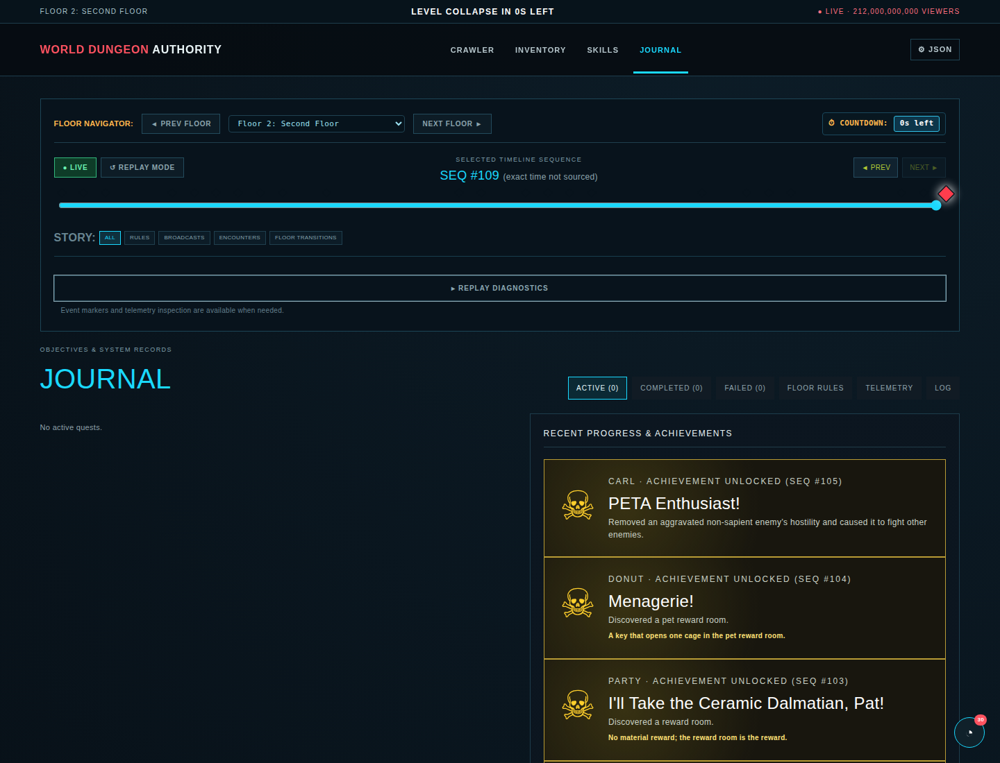
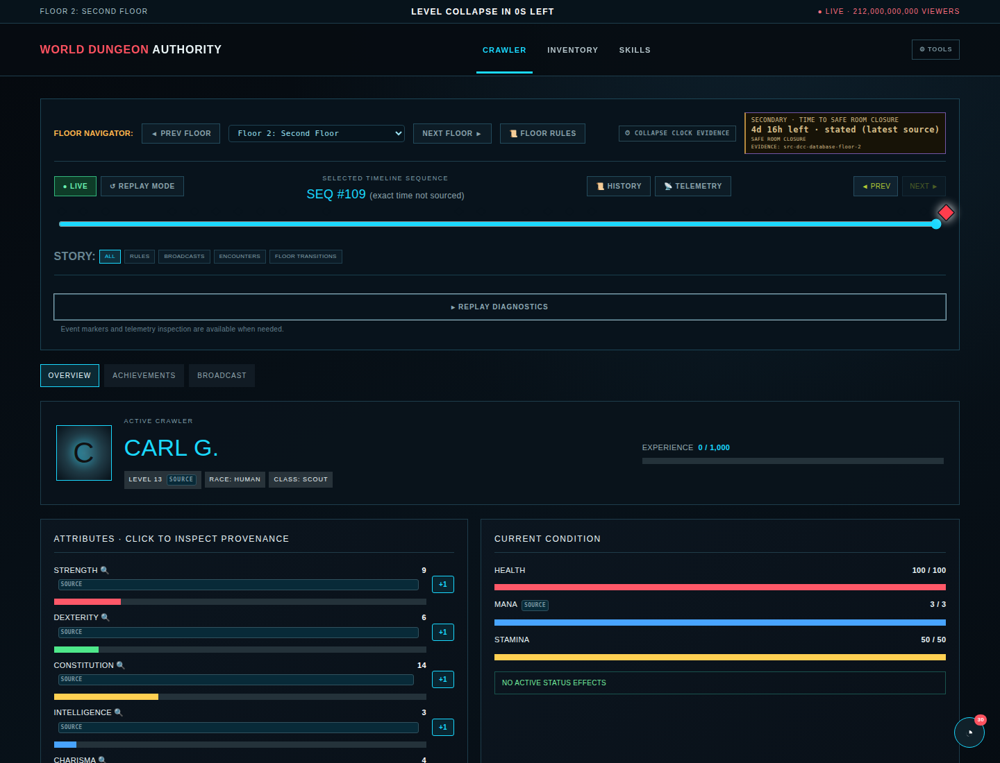
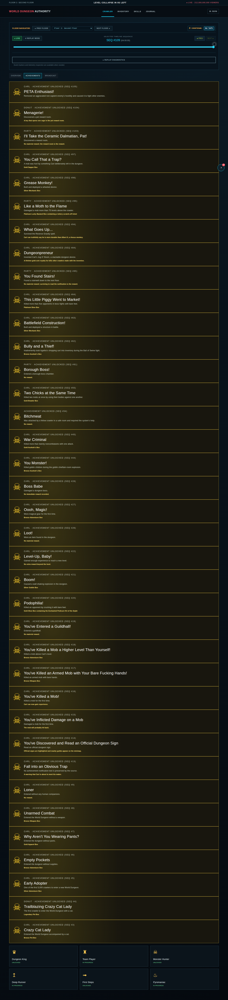
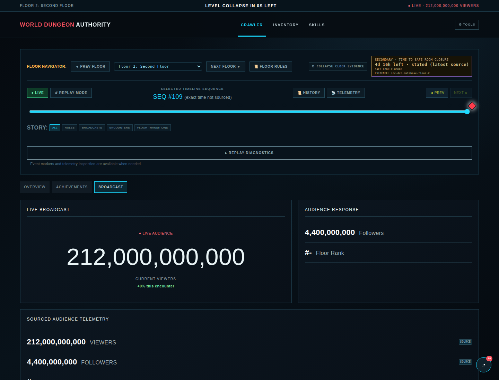

# Interface Screenshots

These images are generated canonical views of the Crawler Command Interface. They are refreshed by `npm run test:screenshots` and by the pull-request screenshot workflow when UI, fixture data, Pages rendering inputs, or screenshot-generation code changes.

Do not retouch these files manually. If a documented interface state changes, update the application or screenshot-generation code and regenerate the assets.

## Top-level views

### Crawler

### Inventory

### Skills

### Journal

## Crawler profile views

### Overview

### Achievements

### Broadcast

