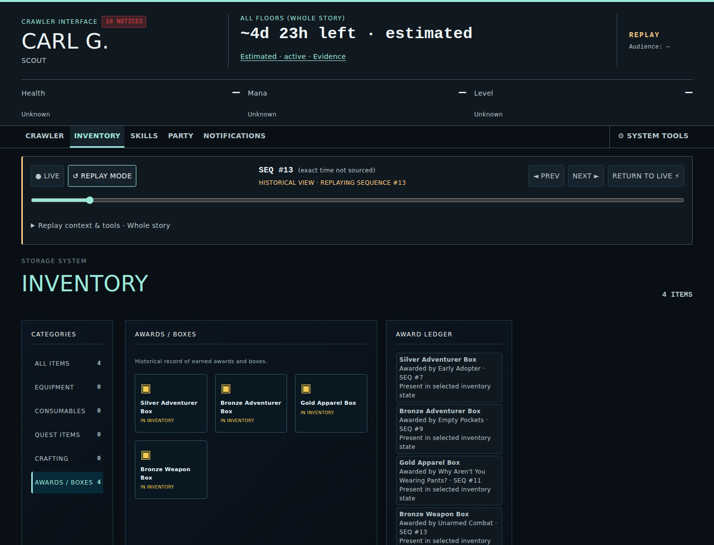
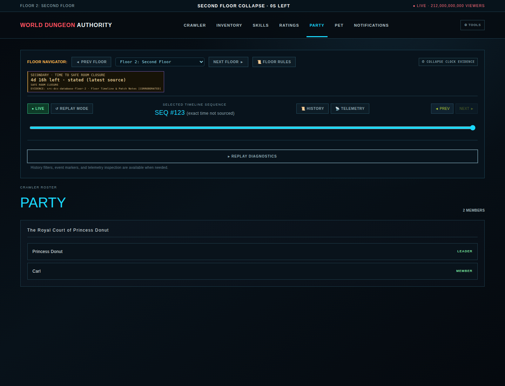
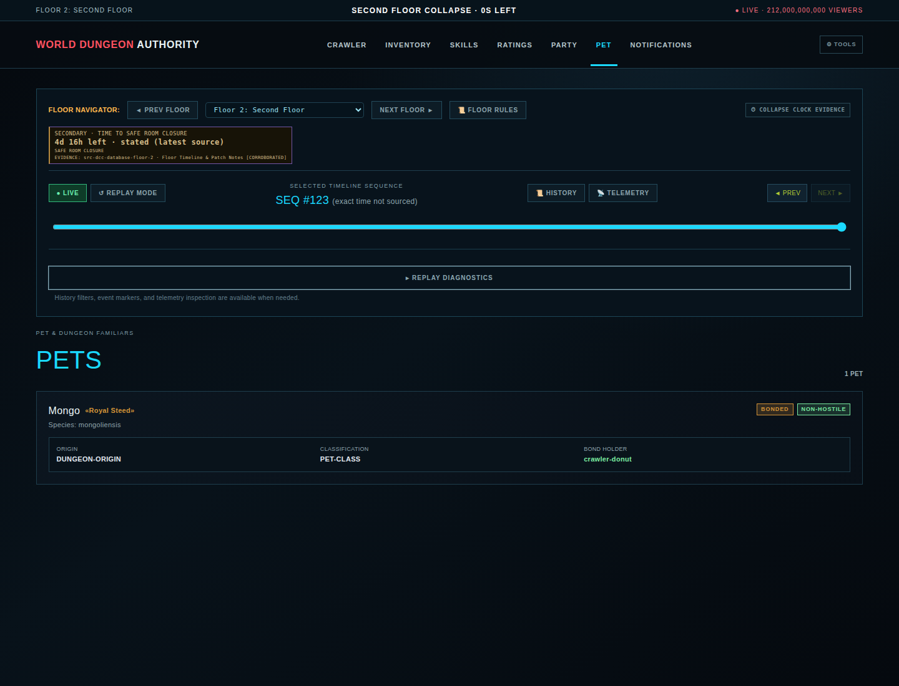

# Interface Screenshots

These images are generated **canonical product views** of the Crawler Command Interface. Refresh the complete set with `npm run test:screenshots`; do not retouch generated images manually.

Canonical screenshots obey the same source-honesty rule as the application: a documented product view must come from real supported story/application state or an explicitly truthful unavailable state. Isolated synthetic Playwright fixtures may exercise rendering behavior, but they are not promoted into `docs/images/` or presented here as story-backed product state.

## Canonical vs. Synthetic Rendering Fixtures

- **Canonical Product Views (`docs/images/screenshot-*.png`)**: Captured directly from the compiled runtime timeline (`data/compiled-timeline.json`) at realistic, supported replay sequence positions. They represent authentic product state backed by authored evidence.
- **Synthetic Test Fixtures**: Isolated Playwright test scenarios (e.g., in `tests/e2e/`) that mock or inject temporary event payloads to exercise UI edge cases or unauthored domain components. These visual outputs are ephemeral test artifacts and are never published as canonical documentation.

## Availability and Replay Reachability Rules

Root navigation and feature availability are strictly capability-driven based on projected state at the selected sequence:

- **Baseline Destinations**: Crawler, Inventory, and Skills are available across all sequence checkpoints.
- **Conditional Destinations**: Ratings, Party, Notifications, Quests, and future domains become navigable only when projected state contains non-empty supported data at the active sequence.
- **Replay Boundary Enforcement**: When scrubbing backward before a domain's activation boundary, its navigation entry disappears and active selection safely resolves to Crawler.
- **Unnavigable Modeled Domains**: Domains like Magic are partially modeled for replay (projecting spell identity, owner, and acquisition source without mechanics) but remain intentionally unnavigable until supported management behavior is introduced.

## Top-level views

### Crawler

### Inventory

### Awards / Boxes
Awards and Boxes appear only after an explicit, source-backed award-to-inventory transition. The ledger preserves award history after a box is opened without claiming that it remains in inventory.

### Skills

### Ratings
Broadcast-domain observations are presented in canon-aligned Ratings groups without renaming the underlying data model.

### Party
The Party roster appears only after the sourced Floor 1 formation sequence and shows no inferred teammate state.

### Pet
The Pet view appears only after a sourced bond unlock and presents origin, classification, hostility, and bond state without Party roster confusion.

### Notifications
Only crawler-visible delivered semantics are represented; generic Timeline activity remains separate.

## Crawler views

### Player Stats

### Health / Conditions
Vitals are separate from beneficial, harmful, injury, and other condition presentation. Injuries are never inferred from effect text.

## Timeline and floor context views

### Floor Rules

### Timeline History

## Noncanonical visual scenarios and regeneration workflow

Playwright may use isolated synthetic timelines for component behavior that has no source-backed Floors 1–2 product state yet. Quests currently fall into this category: the browser test verifies that a projected Quest can render and become navigable, but no Quests screenshot is published as canonical until authored source-backed quest state exists in the supported story scope.

### Screenshot Regeneration and Artifact Publication

1. **Local Regeneration**: Run `npm run test:screenshots` to render the canonical set into `.screenshots-staging/` and promote them to `docs/images/`.
2. **Automated Verification**: The `verify-screenshots` job in `.github/workflows/publish-artifacts.yml` validates and stages PNG screenshots as workflow artifacts on pull request updates.
3. **Approval-Gated Finalization**: Maintainers promote updated screenshot artifacts into `docs/images/` via the approval-gated `publish` job in `publish-artifacts.yml`. Do not manually edit or retouch generated images.
